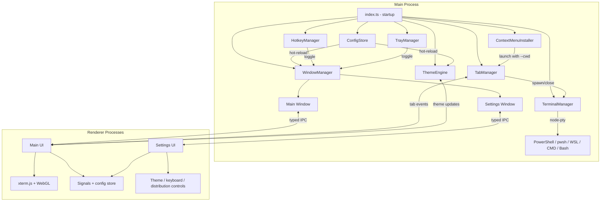

<div align="center">
    
# QuakeShell

**Quake-style drop-down terminal for Windows — instant shell access, always one keystroke away.**

> Press a hotkey. Terminal slides down. Use it. Press again. It vanishes.
> No window management, no alt-tabbing — just a terminal that's always there when you need it.

QuakeShell is a tray-resident Electron app that brings the beloved [Guake](https://github.com/Guake/guake)/[Yakuake](https://apps.kde.org/yakuake/) drop-down terminal experience to Windows, with GPU-accelerated rendering and sub-100ms toggle latency.

<a href="https://buymeacoffee.com/jatson" target="_blank"></a>

The current repo state already includes most of the planned Phase 2 runtime work: tabs, split panes, theming, a dedicated settings window, window sizing controls, and Explorer integration. The active delivery channels today are GitHub Releases and the global npm package; broader package-manager automation is the remaining distribution work.

<!-- Screenshots / demo GIF placeholder — add assets/demo.gif when available -->

</div>

---

## Features

- **Global hotkey toggle** — `Ctrl+Shift+Q` (customizable) shows/hides the terminal instantly
- **Multi-tab workflow** — create, close, reorder, and jump between tabs with `Ctrl+T`, `Ctrl+W`, `Ctrl+Tab`, and `Ctrl+1`-`Ctrl+9`
- **Split panes** — split the active tab with `Ctrl+Shift+D` for side-by-side terminal sessions
- **Per-tab shell selection** — start tabs in PowerShell, PowerShell Core, WSL, Command Prompt, Git Bash, or a custom shell path
- **Dedicated settings window** — `Ctrl+,` opens live settings for General, Appearance, Themes, Keyboard, and Distribution
- **Built-in and community themes** — ships with Tokyo Night, Retro Green, Solarized Dark, plus extra bundled dark/light theme packs, and supports user JSON themes from `%APPDATA%/QuakeShell/themes`
- **Slide animation** — smooth drop-down from the top of your screen with configurable animation speed
- **GPU-accelerated** — xterm.js with WebGL rendering for buttery terminal output
- **Window sizing controls** — configurable height, width, and monitor targeting per display
- **Transparent overlay** — configurable opacity with optional acrylic blur support on supported systems
- **Focus-fade** — terminal auto-hides when you click away (configurable)
- **Multi-monitor aware** — terminal appears on the monitor where your cursor is
- **Hide ≠ Close** — your session, scrollback, and running processes survive every toggle
- **Hot-reload config** — change settings without restarting the app
- **Explorer integration** — optional `Open QuakeShell here` right-click menu for folders and folder backgrounds
- **System tray resident** — no taskbar clutter, just a tray icon
- **Silent autostart** — launches on Windows boot with zero visible splash
- **Single instance** — only one QuakeShell runs; second launch focuses the existing one
- **Shell crash recovery** — auto-restarts the shell if it crashes unexpectedly
- **Onboarding overlay** — teaches the hotkey on first run, lets you configure basics in <30 seconds
- **Hardened Electron** — context isolation, sandbox, CSP, disabled node integration, @electron/fuses

---

## Requirements

- **Windows 10** version 1809 or later (requires ConPTY)
- **Windows 11** fully supported
- **Windows x64** runtime for the packaged release asset consumed by the npm wrapper
- **Node.js 20+** for the global npm installer (`npm 10+` recommended)
- **Node.js 24+** if you plan to clone the repo, run `npm ci`, or use the `release:*` scripts from source
- **Git** only if you plan to clone and develop from source

---

## Installation

```bash
npm install -g quakeshell
```

After install, launch QuakeShell from any terminal with:

```bash
quakeshell
```

The npm package is a thin Windows-only wrapper. During install it downloads the version-matched QuakeShell release zip from GitHub Releases into `%USERPROFILE%\.quakeshell\npm`, verifies the SHA-256 sidecar, and wires the `quakeshell` command to that cached executable.

If you prefer a manual install, download `quakeshell-<version>-win32-x64.zip` from GitHub Releases, extract it anywhere, and launch `quakeshell.exe` directly.

Advanced installer overrides:

- `QUAKESHELL_BINARY_PATH` — use an existing local `quakeshell.exe` instead of downloading
- `QUAKESHELL_ASSET_URL` or `QUAKESHELL_RELEASE_BASE_URL` — point the installer at a custom release mirror
- `QUAKESHELL_INSTALL_ROOT` — change the cache/install root from `%USERPROFILE%\.quakeshell\npm`

To remove the npm-managed QuakeShell payload and cached downloads:

```bash
quakeshell uninstall
```

That command removes the wrapper-managed `versions` and `tmp` directories under `%USERPROFILE%\.quakeshell\npm` or your custom `QUAKESHELL_INSTALL_ROOT`, while preserving `%APPDATA%\QuakeShell` user settings and themes. After cleanup, remove the wrapper command itself with:

```bash
npm uninstall -g quakeshell
```

If you installed into a non-default cache root, pass it explicitly:

```bash
quakeshell uninstall --install-root C:\path\to\quakeshell\npm
```

> npm and GitHub Releases are the active delivery channels today. Scoop and Winget publishing are the main remaining distribution tasks.

---

## Usage

| Action | How |
|--------|-----|
| Toggle terminal | Press `Ctrl+Shift+Q` (or your configured hotkey) |
| New tab | Press `Ctrl+T` |
| Close tab | Press `Ctrl+W` |
| Cycle tabs | Press `Ctrl+Tab` / `Ctrl+Shift+Tab` |
| Jump to tab 1-9 | Press `Ctrl+1` through `Ctrl+9` |
| Split active tab | Press `Ctrl+Shift+D` |
| Open settings | Press `Ctrl+,` |
| Toggle via tray | Left-click the tray icon |
| Open context menu | Right-click the tray icon |
| Launch into a folder | Register `Open QuakeShell here` from Settings -> Distribution, then use Explorer right-click |
| Copy text | Select text, then `Ctrl+C` or `Ctrl+Shift+C` |
| Paste text | `Ctrl+V` or `Ctrl+Shift+V` |
| Scroll history | Mouse wheel or `Ctrl+Shift+Home` / `End` |
| Open URL | Click any URL in terminal output |
| Quit | Right-click tray → **Quit** |

---

## Configuration

QuakeShell stores its config at `%APPDATA%\QuakeShell\config.json` and user themes at `%APPDATA%\QuakeShell\themes\*.json`. Settings are validated against a [Zod](https://zod.dev/) schema, and most of them hot-reload as soon as you save.

Out of the box, QuakeShell includes 15 shipped presets: the 3 core themes (`tokyo-night`, `retro-green`, `solarized-dark`) and 12 additional presets from the bundled dark/light theme packs. User community themes in `%APPDATA%\QuakeShell\themes` are layered after those shipped presets and cannot override shipped theme IDs.

A typical modern config looks like this:

```jsonc
{
    "hotkey": "Ctrl+Shift+Q",
    "defaultShell": "powershell",
    "opacity": 0.85,
    "focusFade": true,
    "animationSpeed": 200,
    "fontSize": 14,
    "fontFamily": "Cascadia Code, Consolas, Courier New, monospace",
    "lineHeight": 1.2,
    "theme": "tokyo-night",
    "autostart": true,
    "acrylicBlur": false,
    "window": {
        "heightPercent": 40,
        "widthPercent": 100,
        "monitor": "active"
    },
    "tabs": {
        "maxTabs": 10,
        "colorPalette": [
            "#7aa2f7",
            "#9ece6a",
            "#bb9af7",
            "#e0af68",
            "#7dcfff",
            "#f7768e"
        ]
    },
    "firstRun": true
}
```

`dropHeight` is still read for older configs, and the current runtime keeps a compatibility bridge between that legacy value and `window.heightPercent`. The example above shows the effective 40% window height most users will expect in current builds.

---

## Architecture



**Key design decisions:**
- Main process owns tabs, PTY lifecycle, window state, and themes
- Renderer communicates exclusively through typed IPC channels via `contextBridge`
- The terminal window is pre-created and hidden instead of spawned on demand, keeping toggle latency low
- Settings live in a dedicated lightweight window, so the terminal surface stays focused and reusable
- The published npm package is wrapper-first: install pulls the matching packaged release asset instead of shipping the Electron app inside the tarball

---

## Tech Stack

| Layer | Technology |
|-------|-----------|
| Runtime | Electron 41 |
| Language | TypeScript |
| Terminal | xterm.js 6 + WebGL addon |
| PTY | node-pty (Windows ConPTY) |
| UI | Preact + @preact/signals |
| Config | Zod + electron-store |
| Build | Electron Forge + Vite |
| Testing | Vitest + Playwright |

---

## Development

```bash
# Clone and install
git clone https://github.com/jatson/QuakeShell.git
cd QuakeShell
npm ci

# Start dev server with hot-reload
npm start

# Run the app test suite
npm test

# Run only the npm wrapper/distribution tests
npm run test:npm

# Package the app
npm run package

# Build installers
npm run make

# Produce the versioned wrapper release zip + checksum locally
npm run release:dry-run
```

Releases are driven by `.github/workflows/release.yml`, not by running `npm publish` manually from a workstation. The workflow expects a git tag that exactly matches `package.json`.

```bash
git tag v1.0.1
git push origin v1.0.1
```

That tag triggers wrapper tests, builds `release/quakeshell-<version>-win32-x64.zip`, creates the GitHub release, and then publishes the npm package.

---

## Security

QuakeShell follows the [Electron security checklist](https://www.electronjs.org/docs/latest/tutorial/security) in full:

- `contextIsolation: true` — main and renderer processes are fully separated
- `sandbox: true` — renderer has no Node.js access
- `nodeIntegration: false` — no `require()` in the renderer
- Strict CSP — `default-src 'self'; script-src 'self'; style-src 'self' 'unsafe-inline'`
- `@electron/fuses` — disables debugging and remote code loading in production
- Typed IPC via `contextBridge` — no raw `ipcRenderer` exposure
- Zero telemetry, zero remote resource loading, fully offline by default

---

## Status

- Most Phase 2 runtime features are already in the repo: tabs, split panes, per-tab shell selection, themes, window sizing, settings, and Explorer integration.
- The remaining Phase 2 gap is broader distribution rollout. GitHub Releases and npm are live; Scoop and Winget automation are next.

## Roadmap

### Near Term
- Finish Scoop publishing automation
- Finish Winget PR automation
- Keep tightening onboarding and update polish

### Longer Term
- SSH, telnet, serial connections
- Plugin architecture
- Cross-platform (macOS, Linux)
- Profile system with shareable configs
- Full MobaXterm feature parity (long-term vision)

---

## Comparison

| Feature | QuakeShell | Windows Terminal | ConEmu | Tabby |
|---------|-----------|-----------------|--------|-------|
| Drop-down mode | **Core** | No | Dated | Heavy |
| Modern rendering | WebGL | DirectX | GDI | WebGL |
| Open source | MIT | Yes | Yes | Yes |
| WSL support | Yes | Yes | Partial | Yes |
| Focus-fade | Yes | No | Basic | Basic |
| Lightweight | ~150 MB | ~30 MB | ~15 MB | ~120 MB |

---

## Contributing

Contributions are welcome. For runtime or UI changes, run `npm test`. For packaging or release changes, also run `npm run test:npm` and `npm run release:dry-run` before opening a PR.

---

## License

MIT — built by [Barna](https://github.com/jatson).
