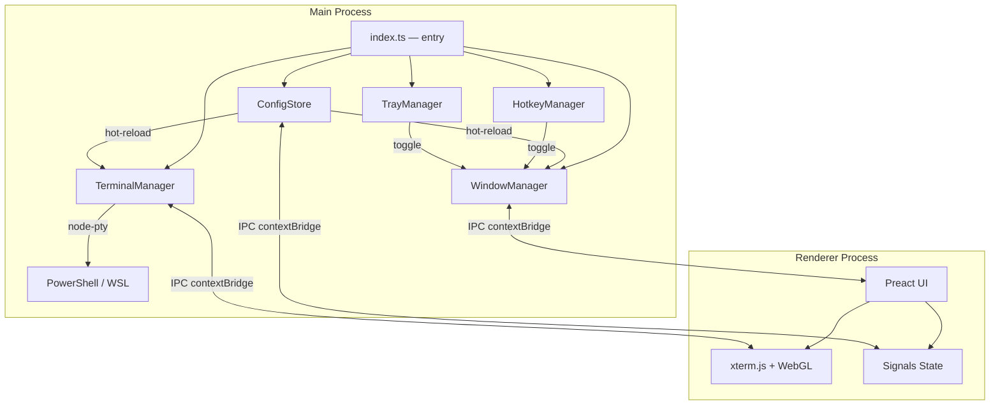

# QuakeShell

**Quake-style drop-down terminal for Windows — instant shell access, always one keystroke away.**

> Press a hotkey. Terminal slides down. Use it. Press again. It vanishes.
> No window management, no alt-tabbing — just a terminal that's always there when you need it.

QuakeShell is a tray-resident Electron app that brings the beloved [Guake](https://github.com/Guake/guake)/[Yakuake](https://apps.kde.org/yakuake/) drop-down terminal experience to Windows, with GPU-accelerated rendering and sub-100ms toggle latency.

<!-- Screenshots / demo GIF placeholder — add assets/demo.gif when available -->

---

## Features

- **Global hotkey toggle** — `Ctrl+Shift+Q` (customizable) shows/hides the terminal instantly
- **Slide animation** — smooth 200ms drop-down from the top of your screen at 60fps
- **GPU-accelerated** — xterm.js with WebGL rendering for buttery terminal output
- **PowerShell & WSL** — use your preferred shell out of the box
- **Transparent overlay** — configurable opacity (default 85%) lets you see your work underneath
- **Focus-fade** — terminal auto-hides when you click away (configurable)
- **Multi-monitor aware** — terminal appears on the monitor where your cursor is
- **Hide ≠ Close** — your session, scrollback, and running processes survive every toggle
- **Hot-reload config** — change settings without restarting the app
- **System tray resident** — no taskbar clutter, just a tray icon
- **Silent autostart** — launches on Windows boot with zero visible splash
- **Single instance** — only one QuakeShell runs; second launch focuses the existing one
- **Shell crash recovery** — auto-restarts the shell if it crashes unexpectedly
- **Onboarding overlay** — teaches the hotkey on first run, lets you configure basics in <30 seconds
- **Hardened Electron** — context isolation, sandbox, CSP, disabled node integration, @electron/fuses

---

## Requirements

- **Windows 10** version 1809 or later (requires ConPTY)
- **Windows 11** fully supported

---

## Installation

```bash
npm install -g quakeshell
```

After install, QuakeShell registers for silent autostart on next Windows boot. You can also launch it manually from the Start menu or command line.

> **Coming in Phase 2:** `scoop install quakeshell` and `winget install QuakeShell`

---

## Usage

| Action | How |
|--------|-----|
| Toggle terminal | Press `Ctrl+Shift+Q` (or your configured hotkey) |
| Toggle via tray | Left-click the tray icon |
| Open context menu | Right-click the tray icon |
| Copy text | Select text, then `Ctrl+C` or `Ctrl+Shift+C` |
| Paste text | `Ctrl+V` or `Ctrl+Shift+V` |
| Scroll history | Mouse wheel or `Ctrl+Shift+Home` / `End` |
| Open URL | Click any URL in terminal output |
| Quit | Right-click tray → **Quit** |

---

## Configuration

QuakeShell stores its config at `%APPDATA%/QuakeShell/config.json`. All settings are validated against a [Zod](https://zod.dev/) schema and hot-reload on save (except shell type, which requires a terminal restart).

```jsonc
{
  "hotkey": "Ctrl+Shift+Q",       // Global toggle hotkey
  "defaultShell": "powershell",   // "powershell" or "wsl"
  "opacity": 0.85,                // 0 (invisible) – 1 (opaque)
  "focusFade": true,              // Auto-hide on blur
  "animationSpeed": 200,          // Slide duration in ms (50–1000)
  "fontSize": 14,                 // 8–32px
  "fontFamily": "Cascadia Code, Consolas, Courier New, monospace",
  "dropHeight": 30,               // Terminal height as % of screen (10–100)
  "autostart": true,              // Launch on Windows boot
  "firstRun": true                // Show onboarding overlay
}
```

---

## Architecture



**Key design decisions:**
- Main process is the single source of truth for all state
- Renderer communicates exclusively through typed IPC channels via `contextBridge`
- Window is pre-created and hidden — never spawned on demand — guaranteeing <100ms toggle
- Terminal sessions persist across hide/show cycles (hide ≠ close)

---

## Tech Stack

| Layer | Technology |
|-------|-----------|
| Runtime | Electron 41 (Chromium 146, Node.js 24) |
| Language | TypeScript |
| Terminal | xterm.js 6 + WebGL addon |
| PTY | node-pty (Windows ConPTY) |
| UI | Preact + @preact/signals |
| Config | Zod + electron-store |
| Build | Electron Forge + Vite |
| Testing | Vitest + Playwright |

---

## Development

```bash
# Clone and install
git clone https://github.com/jatson/quakeshell.git
cd quakeshell
npm install

# Start dev server with hot-reload
npm start

# Run unit tests
npm test

# Lint
npm run lint

# Package the app
npm run package

# Build installers
npm run make
```

---

## Security

QuakeShell follows the [Electron security checklist](https://www.electronjs.org/docs/latest/tutorial/security) in full:

- `contextIsolation: true` — main and renderer processes are fully separated
- `sandbox: true` — renderer has no Node.js access
- `nodeIntegration: false` — no `require()` in the renderer
- Strict CSP — `default-src 'self'; script-src 'self'; style-src 'self' 'unsafe-inline'`
- `@electron/fuses` — disables debugging and remote code loading in production
- Typed IPC via `contextBridge` — no raw `ipcRenderer` exposure
- Zero telemetry, zero remote resource loading, fully offline by default

---

## Roadmap

### Phase 2 — Growth (v1.x)
- Multi-tab terminal sessions (`Ctrl+T` / `Ctrl+W`)
- In-app settings GUI (`Ctrl+,`)
- Per-tab shell switching (PowerShell ↔ WSL)
- Theming engine with community themes
- Scoop & Winget distribution
- Shell context menu ("Open QuakeShell here")

### Phase 3 — Expansion (v2+)
- SSH, telnet, serial connections
- Plugin architecture
- Cross-platform (macOS, Linux)
- Profile system with shareable configs
- Full MobaXterm feature parity (long-term vision)

---

## Comparison

| Feature | QuakeShell | Windows Terminal | ConEmu | Tabby |
|---------|-----------|-----------------|--------|-------|
| Drop-down mode | **Core** | No | Dated | Heavy |
| Modern rendering | WebGL | DirectX | GDI | WebGL |
| Open source | MIT | Yes | Yes | Yes |
| WSL support | Yes | Yes | Partial | Yes |
| Focus-fade | Yes | No | Basic | Basic |
| Lightweight | ~150 MB | ~30 MB | ~15 MB | ~120 MB |

---

## Contributing

Contributions are welcome starting Phase 2. In the meantime, feel free to open issues for bugs and feature requests.

---

## License

MIT — built by [Barna](https://github.com/jatson).
