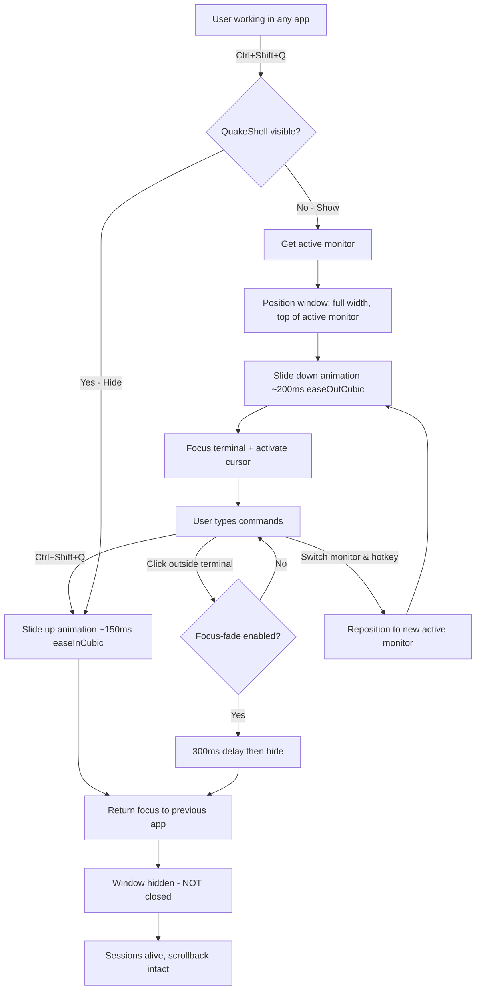
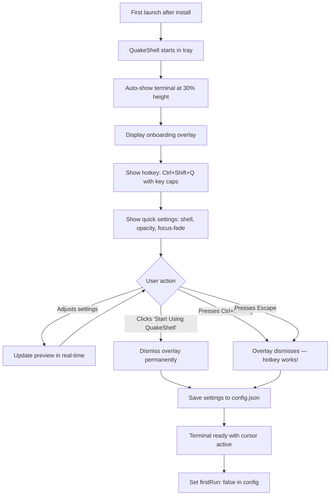
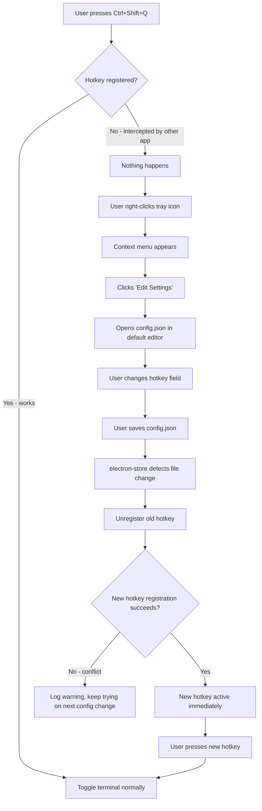
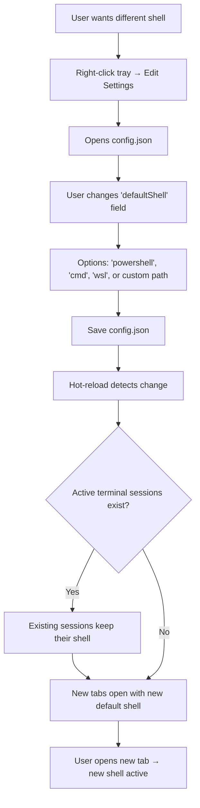
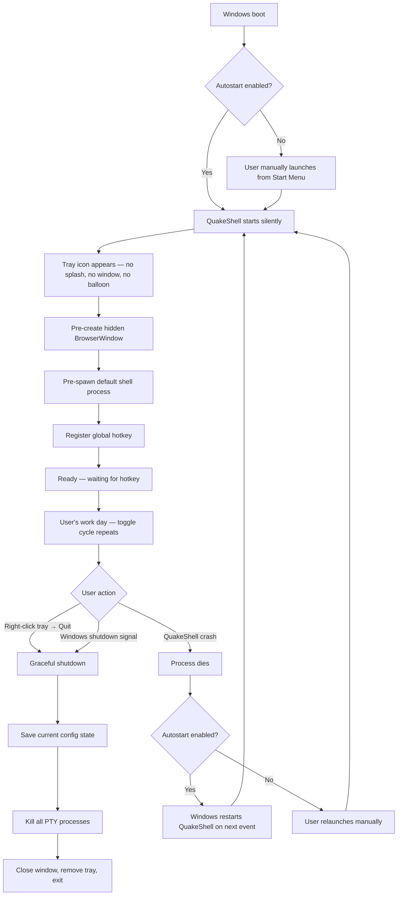
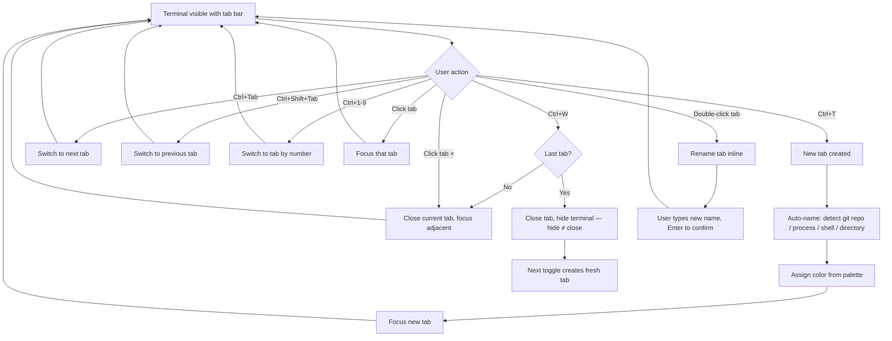
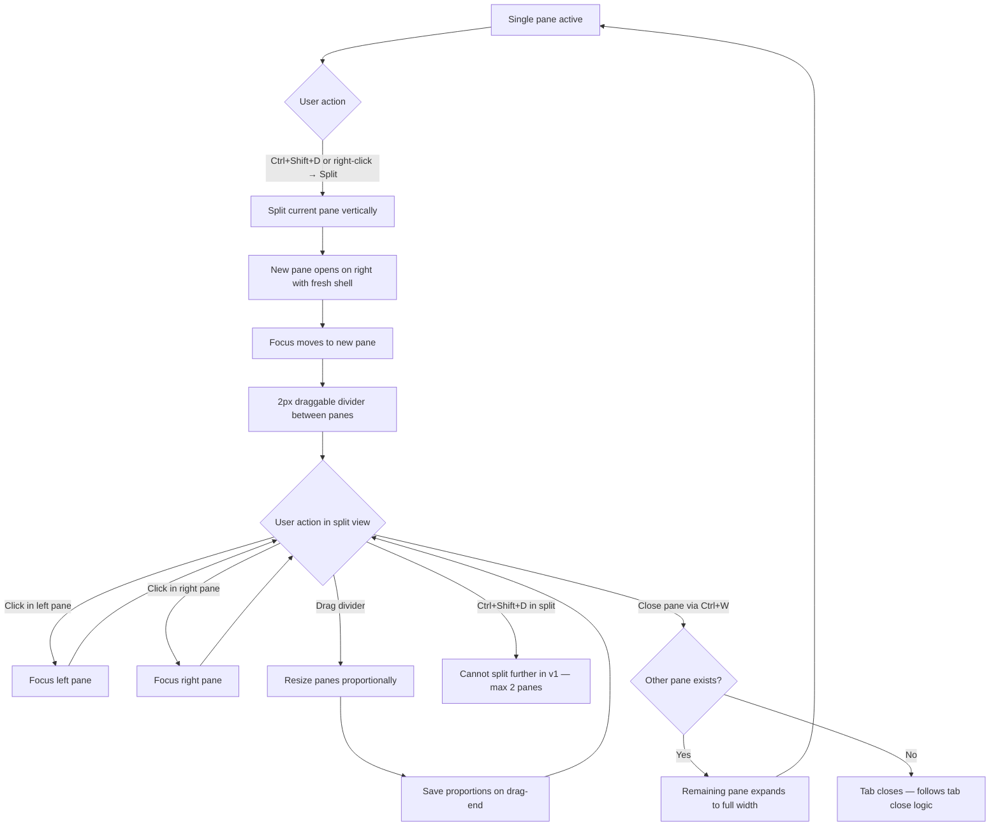
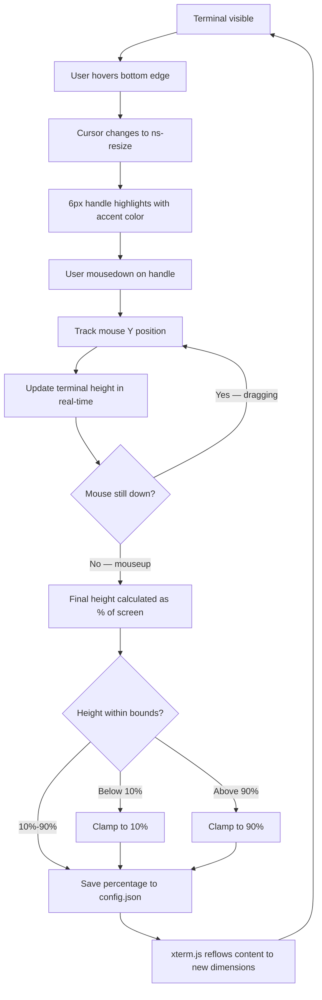

# UX Design Specification QuakeShell

**Author:** Barna
**Date:** 2026-03-31

---

## Executive Summary

### Project Vision

QuakeShell is a Quake-style drop-down terminal for Windows — a tray-resident application that slides down from the top of the screen on a global hotkey, providing instant PowerShell and WSL access without window management overhead. The UX vision is "invisible infrastructure": a terminal that becomes muscle memory, always one keypress away, and completely gone when not needed. The product fills a clear gap — no modern, open-source, lightweight drop-down terminal exists for Windows today.

### Target Users

**Primary: Windows developers and power users** who live in the terminal daily — backend engineers, DevOps practitioners, sysadmins, and CLI-native developers. Many have used Guake or Yakuak on Linux and miss the drop-down workflow on Windows. They are highly technical, keyboard-driven, and value speed over visual polish. The core persona is the developer who runs 30-50 terminal commands per day and wants zero friction between "I need a shell" and "I'm typing a command."

**Secondary (future): Remote access power users** who need SSH, telnet, and multi-protocol access — currently served by MobaXterm but seeking an open-source, extensible alternative.

### Key Design Challenges

1. **Invisible app, discoverable UX** — QuakeShell has no window chrome, no taskbar presence, no menu bar. The entire interaction surface is a hotkey, a tray icon, and the terminal itself. Feature discoverability (settings, shell switching, notifications) must work within these extreme constraints without adding visual clutter that contradicts the product's identity.

2. **First-run cliff** — The core UX is "press a hotkey and magic happens," but the user must learn the hotkey first. Onboarding must teach the muscle memory in under 30 seconds while gracefully handling hotkey conflicts with other applications (gaming overlays, streaming tools, IDE shortcuts).

3. **Focus-fade tension** — Auto-hiding on blur is the power-user dream but a newcomer trap. Clicking anywhere outside the terminal makes it vanish, which can confuse new users. Defaults and communication must balance power-user efficiency with newcomer comprehension.

4. **Shell switching friction (v1)** — Without tabs in v1, switching between PowerShell and WSL requires changing a config setting and restarting the terminal session. This known limitation must feel intentional and temporary, not broken.

### Design Opportunities

1. **The "invisible infrastructure" feeling** — When executed well, QuakeShell becomes something users stop thinking about entirely. Like a keyboard shortcut burned into muscle memory, the UX goal is to disappear into the workflow. This is a rare and powerful design achievement.

2. **First-run delight** — The first hotkey press is the product's "aha moment." The slide-down animation, the transparency, the instant response — this is the viral moment for Hacker News demos and screen recordings. Onboarding should make this moment theatrical and memorable.

3. **Opinionated defaults with escape hatches** — Ship with excellent defaults (F12 hotkey, 85% opacity, focus-fade on, 40% screen height) so most users never need to touch settings. Provide full configurability for power users who will customize everything.

## Core User Experience

### Defining Experience

The core experience of QuakeShell is the **toggle loop**: press a hotkey → terminal slides down → use the shell → press hotkey again (or click away) → terminal disappears. This loop happens 30-50 times per day for the target user. Every design decision serves this single interaction pattern. If the toggle loop is not instant, effortless, and reliable, no other feature matters.

The terminal is not a window to manage — it is an **ambient capability** summoned and dismissed with a single keypress. There is no opening, closing, minimizing, or arranging. The user's mental model is: "I need a shell" → keypress → shell is there. "I'm done" → keypress → shell is gone.

**Critical distinction: hide vs. close.** Dismissing the terminal (hotkey, focus-fade, tray click) is always a *hide* operation — the session remains fully alive. Scrollback, working directory, environment variables, running processes — all intact. Closing a session is a separate, explicit manual action (future: X button on tab or Ctrl+W, browser-style). Hide is the default. Close is deliberate.

### Platform Strategy

- **Platform:** Windows desktop only — Windows 10 (version 1809+) and Windows 11
- **Input model:** Keyboard-primary. Mouse is a secondary fallback (tray icon toggle, settings access). All core interactions work without touching the mouse
- **Runtime model:** Tray-resident background daemon. No taskbar presence, no traditional window lifecycle. Pre-created hidden BrowserWindow toggled via show/hide for sub-100ms response
- **Network:** Fully offline, local-only terminal emulator. Network used only for optional update checks
- **Platform integration:** Windows ConPTY for terminal I/O, system tray for persistent presence, global keyboard hook for hotkey, Windows login items for silent autostart, Windows toast notifications for terminal events
- **Multi-monitor:** Terminal appears on the display where the cursor is currently located. The user should never have to think about which monitor the terminal drops down on

### Effortless Interactions

These interactions must require zero cognitive effort from the user:

1. **The toggle** — hotkey press to visible terminal in sub-100ms. No perceptible delay, no loading state, no animation stutter. The terminal is always pre-created and waiting
2. **State persistence** — scrollback, running processes, working directory survive every show/hide cycle. The user never loses context. A `docker compose up` started before hiding is still running when the terminal reappears
3. **History persistence** — command history and terminal scrollback survive application restarts and reboots. QuakeShell must not interfere with shell-level history persistence (PowerShell `PSReadLine` history, bash `.bash_history`) and should preserve terminal scrollback across sessions where possible
4. **Autostart** — after initial install, QuakeShell is silently present on every Windows boot. The user never manually launches it again. No splash screen, no tray balloon, no visible startup sequence
5. **Disappearing** — click away or press the hotkey, the terminal is gone. No close confirmation, no minimize decision, no "are you sure" dialogs. Hide is instant and non-destructive. The session is always alive underneath
6. **Visual integration** — the semi-transparent terminal should feel like a native layer of the Windows desktop, not a foreign overlay. Opacity is a functional tool for keeping underlying content readable while working in the terminal, not just an aesthetic preference. Default 85% opacity should make content underneath *legible*

### Critical Success Moments

1. **First hotkey press** — the terminal slides down with a smooth animation, semi-transparent, GPU-rendered. This is the "I'm keeping this" moment — the product's entire viral potential lives in this 200ms interaction
2. **The 10th toggle of the day** — the user realizes they haven't thought about terminal access once. QuakeShell has become invisible infrastructure. This is the retention moment
3. **After reboot** — user presses the hotkey out of habit on a fresh Windows boot. It works instantly. Command history from yesterday is still there. They didn't configure anything, didn't launch anything. This is the "it just works" moment that builds trust
4. **Hotkey conflict resolution** — the default hotkey doesn't work because another app intercepted it. The user right-clicks the tray icon, opens settings, remaps the hotkey in 10 seconds. Crisis averted, confidence maintained. This is the error recovery moment that prevents uninstalls
5. **Terminal crash recovery** — a shell process dies unexpectedly. QuakeShell detects the exit, auto-restarts the shell, and notifies the user. No data loss beyond the crashed process itself. Scrollback is preserved. The user's trust in "always there" is maintained
6. **Accidental dismiss** — user clicks outside the terminal while a long build is running (focus-fade enabled). They press the hotkey again — the build is still running, output is still scrolling. Hide never kills. The user learns to trust the dismiss gesture

### Experience Principles

1. **Speed is the feature** — sub-100ms toggle latency or it's a regression. Every millisecond matters. The terminal is pre-created and hidden, never spawned on demand. Animation runs at 60fps. Input-to-render latency stays under 16ms
2. **Disappear into the workflow** — QuakeShell succeeds when users forget it exists as a separate application. It should feel like a built-in OS capability, not a third-party tool running in the background
3. **Keyboard-first, always** — every core interaction works without touching the mouse. The hotkey is the primary interface. The tray icon and settings UI are escape hatches, not the main path. Future features (tabs, shell switching) follow the same principle — keyboard commands first, mouse UI second
4. **No decisions at usage time** — configure once (or accept great defaults), then never think about settings during daily use. The toggle loop has zero decision points, zero dialogs, zero confirmations
5. **Hide is not close** — dismissing the terminal is always non-destructive. Sessions, processes, scrollback, and history persist across hides. Closing a session is a separate, explicit manual action (Ctrl+W or click X). The user must trust that hiding is safe
6. **Terminal complements, never competes** — the terminal is a transparent layer over the user's workspace, not a full-screen takeover. Opacity exists so users can see both the terminal and what's behind it simultaneously. The default experience supports working with both layers at once

## Desired Emotional Response

### Primary Emotional Goals

The emotional core of QuakeShell is **quiet competence** — the feeling of having superpowers that nobody else can see. This is not a product that seeks to impress with visual spectacle or feature density. It earns loyalty through the deep satisfaction of a tool that makes the user feel faster, sharper, and more in control of their machine.

- **Empowered** — "I have instant access to my machine's full power, one keypress away." The user feels capable and in command
- **Effortless mastery** — "I didn't learn anything complex, but I feel like a pro using this." Low learning curve, high perceived skill
- **Trust** — "I can dismiss this without thinking. My work is always safe." The hide-is-not-close guarantee becomes a felt experience, not a documented feature
- **Flow state protection** — "I never broke concentration to access a terminal." The product's highest emotional achievement is the absence of disruption

### Emotional Journey Mapping

| Stage | Desired Feeling | What Triggers It |
|---|---|---|
| First discovery (install) | Curiosity + low-effort optimism | Installation takes seconds, no configuration required |
| First hotkey press | Instant delight + surprise | The slide animation, the speed, the transparency — the "aha moment" |
| First week of daily use | Growing confidence + ownership | Muscle memory forming, forgetting QuakeShell is a separate application |
| After first reboot | Trust + reliability | Terminal is already there, command history intact, nothing to configure |
| Something goes wrong | Calm, not panic | Hotkey conflict resolved in 10 seconds, shell crash auto-recovered with notification |
| Telling a friend | Pride + "you gotta try this" | Showing the toggle to someone — the demo is the pitch |

### Micro-Emotions

**Emotions to cultivate:**

- **Confidence over confusion** — every interaction should feel predictable after the first use. No hidden states, no surprising behaviors
- **Trust over skepticism** — the hide-is-not-close guarantee must be *felt* through repeated safe experience, not just documented in a tooltip
- **Satisfaction over delight** — this is a precision tool, not a toy. Quiet "this is good" beats "wow!" The emotional signature is understated reliability

**Emotions to actively prevent:**

- **Confusion** — "Where did my terminal go?" / "Where are my settings?" — every UI element must have an obvious escape hatch
- **Anxiety** — "Did I lose my work when it disappeared?" — the first few hides must build the trust that sessions persist
- **Overwhelm** — "Too many settings, I don't know what I'm doing" — defaults must be good enough that most users never open settings
- **Abandonment** — "This doesn't work and I can't figure out why" — hotkey conflicts and failures must have immediate, visible recovery paths

### Design Implications

| Emotional Goal | UX Design Approach |
|---|---|
| Empowered | Sub-100ms toggle response; no loading states; terminal is always ready and waiting |
| Effortless mastery | First-run onboarding teaches the one interaction that matters; no manual required |
| Trust | Hide-is-not-close enforced at every touchpoint; running processes visible on return; no data loss ever |
| Flow state protection | No modal dialogs during toggle loop; no confirmations; no notifications that interrupt active terminal use |
| Calm during errors | Auto-recovery from shell crashes; clear conflict detection; tray icon as visible fallback when hotkey fails |
| Pride in showing others | The slide-down animation is polished enough to demo; the toggle speed is visibly impressive |

### Emotional Design Principles

1. **Earn trust through repetition** — every show/hide cycle where the session is intact builds emotional trust. This compounds over days. By week two, the user stops worrying entirely
2. **Understate, don't overstate** — no celebratory animations, no achievement badges, no "tip of the day." The product's emotional register is calm competence. Polish is felt, not announced
3. **Make failure feel temporary** — when something breaks (hotkey conflict, shell crash, config corruption), the recovery should feel like a 10-second detour, not a crisis. Every error state has a clear, immediate next step
4. **The demo is the emotion** — the first hotkey press is both the functional core and the emotional peak. If someone watches you use QuakeShell and says "what was that?", the product has succeeded emotionally

## UX Pattern Analysis & Inspiration

### Inspiring Products Analysis

**PowerShell / Linux CLI**
- **What inspires:** The raw capability — full OS control from a text interface. Everything is reachable. This is the power that QuakeShell must preserve and amplify, never restrict
- **UX gap QuakeShell addresses:** PowerShell gives you the power but not the management. Multiple sessions become a mess of unnamed windows. No visual identity, no organization, no spatial awareness of what's running where. QuakeShell wraps this power in proper terminal management UX

**VS Code Integrated Terminal**
- **What inspires:** Split pane terminals (side-by-side viewing), tab management with rename capability, keyboard shortcuts for terminal switching (Ctrl+PageUp/Down), shell type icons in tab bar, integrated feel within the workflow
- **Key pattern to adopt:** The ability to attach two terminals side-by-side for simultaneous viewing (e.g., frontend logs + backend logs). This is the multi-terminal interaction pattern QuakeShell should target for Phase 2
- **UX gap:** VS Code's terminal is embedded in the IDE — it competes for screen space with the editor. QuakeShell's drop-down model gives the terminal its own dedicated screen layer that doesn't steal from the workspace

**Guake / Yakuak (Linux drop-down terminals)**
- **What inspires:** The original Quake-style toggle UX — hotkey summon, top-of-screen slide, instant dismiss. The muscle memory pattern that QuakeShell brings to Windows
- **Key pattern to adopt:** The core toggle loop, tray-resident lifecycle, full-width drop-down from screen top, partial screen coverage (~30% height) keeping most of the workspace visible
- **UX limitation to improve:** Basic tab management, minimal visual identity for tabs, no split pane — QuakeShell should exceed these originals

**Spotlight / Raycast / PowerToys Run (Global hotkey → instant UI → dismiss)**
- **What inspires:** The "summon and dismiss" UX pattern: global hotkey → UI appears instantly → do your thing → dismiss. Zero window management. This is the same fundamental pattern as QuakeShell's toggle, applied to search instead of terminal
- **Key pattern to adopt:** The sub-200ms appearance, the "always ready" feeling, the muscle memory of a single hotkey for a single purpose

### Transferable UX Patterns

**Navigation Patterns:**
- **VS Code terminal tab bar** — tabs with shell-type icons, rename on double-click, close on middle-click/X button, keyboard switching. Adapt for QuakeShell's drop-down context (Phase 2)
- **VS Code split pane** — drag a terminal tab to split, or use a keyboard shortcut. Side-by-side terminals in the same drop-down panel (Phase 2)
- **Browser tab model** — Ctrl+T for new tab, Ctrl+W to close, Ctrl+Tab to switch. Universally understood keyboard patterns. QuakeShell tabs should follow these conventions

**Interaction Patterns:**
- **Spotlight instant-summon** — global hotkey → UI appears in <200ms → ready for input. No loading screen, no transition state. QuakeShell's toggle must match this responsiveness
- **macOS Dock badge notifications** — subtle visual indicator that something needs attention without interrupting flow. QuakeShell's tray icon or tab should indicate when a background terminal needs attention (e.g., process exited, command completed)

**Visual Identity Patterns:**
- **VS Code terminal color decorators** — colored left border per terminal for instant visual identification. Adapt for QuakeShell tabs
- **Tab auto-naming strategy** (new pattern for QuakeShell):
  - Priority 1: Git repository name (when working directory is inside a repo) — e.g., "quakeshell"
  - Priority 2: Running process name (if a long-running command is active) — e.g., "npm run dev"
  - Priority 3: Shell type (PowerShell / WSL: Ubuntu / cmd)
  - Priority 4: Working directory basename as fallback
  - User can manually rename any tab to override auto-naming
- **Tab color coding:** Each terminal gets an accent color (auto-assigned from a palette, user-overridable). Color appears in tab background/border and optionally as a subtle tint on the terminal itself. The user can instantly distinguish "blue = backend" from "green = frontend" at a glance

**Window Behavior Patterns:**
- **Multi-monitor: follow active window** — terminal drops down on the monitor where the currently focused window is. If no window is focused (e.g., desktop clicked), fall back to the primary monitor. This follows the user's work context, not just cursor position
- **Partial screen coverage** — terminal occupies 100% monitor width but only ~30% screen height by default. Keeps the majority of the workspace visible underneath, reinforcing the "terminal complements, never competes" principle. Height is configurable via settings
- **Full-width drop-down** — the terminal spans the entire width of the active monitor, edge to edge. No side margins, no floating window. This is the Guake/Yakuak convention and maximizes terminal real estate

### Anti-Patterns to Avoid

- **Windows Terminal's tab anonymity** — default tabs are all named "PowerShell" with no visual distinction. Users with 5+ tabs can't tell them apart. QuakeShell must auto-differentiate from the start
- **Tabby's configuration complexity** — deep YAML/JSON config for basic features. QuakeShell settings should be GUI-first with config file as power-user escape hatch
- **ConEmu's visual clutter** — toolbar, status bar, tab bar, menu bar all competing for space in a small window. QuakeShell should have near-zero chrome. The terminal content is the UI
- **Modal settings that interrupt workflow** — any settings change that requires closing the terminal or restarting the app. QuakeShell settings should apply instantly (hot-reload)
- **Invisible tray-only apps with no discoverability** — if the only way to access settings is right-clicking a 16x16 pixel tray icon, new users will never find it. First-run onboarding and a keyboard shortcut for settings (e.g., Ctrl+,) are essential
- **Fixed monitor assumption** — apps that always open on the primary monitor regardless of where the user is working. On multi-monitor setups this forces the user to look away from their active work

### Design Inspiration Strategy

**What to Adopt:**
- Spotlight/Raycast instant-summon pattern — the core toggle UX responsiveness benchmark
- VS Code split pane model — side-by-side terminals in Phase 2
- Browser keyboard conventions — Ctrl+T/W/Tab for tab management
- VS Code color decorator pattern — visual identity per terminal
- Guake full-width partial-height drop-down — 100% width, 30% height default

**What to Adapt:**
- VS Code terminal tab bar — simplified for drop-down context (narrower, denser, auto-named)
- Tab auto-naming — custom priority chain (git repo → process → shell → directory) unique to QuakeShell
- Tab coloring — auto-assigned palette with user override, more prominent than VS Code's subtle left border
- Multi-monitor behavior — follow active window context, not cursor position

**What to Avoid:**
- Windows Terminal's anonymous tabs — no visual distinction between terminals
- Tabby's configuration depth — GUI-first, not config-first
- ConEmu's visual clutter — near-zero chrome, terminal content is the UI
- Modal/restart-requiring settings — everything hot-reloads
- Fixed-monitor apps — always follow the user's active context

## Design System Foundation

### Design System Choice

**Custom minimal CSS** — hand-written, minimal styling for the small number of non-terminal UI surfaces. No CSS framework or component library.

QuakeShell is not a traditional UI-heavy application. The product's visual surface is dominated by the terminal (rendered by xterm.js with its own theming system). The non-terminal UI elements are limited to:
- First-run onboarding overlay
- Tab bar (Phase 2)
- System tray context menu (native OS, no styling needed)
- Tray notifications (native OS)

This minimal UI surface does not justify a CSS framework or component library. Custom CSS keeps the bundle small, avoids dependency bloat, and aligns with the "near-zero chrome" design philosophy — the terminal content is the UI.

### Rationale for Selection

- **Minimal UI surface:** Only 2-3 non-terminal UI elements in v1. A component library would be overkill
- **xterm.js handles terminal theming:** Color schemes, fonts, cursor styles are all managed by xterm.js's built-in theme system — no CSS framework needed for the core product surface
- **Bundle size discipline:** No unnecessary dependencies. Every byte matters for a lightweight utility
- **Solo developer context:** One developer doesn't need a design system for team consistency. Custom CSS is faster to write and debug for this scale
- **Philosophy alignment:** "Near-zero chrome" and "terminal content is the UI" are incompatible with heavy UI frameworks

### Implementation Approach

**Terminal visual layer (xterm.js theme system):**
- Color scheme (background, foreground, ANSI colors) defined in xterm.js `ITheme` interface
- Font family, size, line height configured via xterm.js `ITerminalOptions`
- Cursor style and blink behavior via xterm.js options
- All terminal visual settings exposed in the JSON config file and hot-reloaded on change

**Non-terminal UI layer (custom CSS):**
- CSS custom properties (variables) for shared values: accent color, border radius, spacing, font stack
- Dark theme only for v1 — terminal apps are dark by default, and it matches the semi-transparent overlay aesthetic
- Minimal animations: only the slide-down/up toggle animation and subtle transitions for settings panel
- No CSS preprocessor — plain CSS with custom properties is sufficient for this scale

**Configuration layer:**
- **v1: JSON config file** — `electron-store` with JSON schema validation. Developer-friendly, hot-reloaded on file save
- Config file opened from tray menu ("Edit Settings" → opens JSON in user's default text editor)
- Well-documented defaults with clear descriptions for every setting
- Schema validation catches invalid values and falls back to defaults with user notification
- **Phase 2: Settings GUI overlay** — in-app settings panel (Ctrl+, to open) layered over the terminal. Reads/writes the same JSON config. Not a separate window — an overlay within the drop-down. Power users can still edit the JSON directly

### Customization Strategy

**User-facing customization surfaces (v1):**

| Setting | Method | Hot-reload |
|---|---|---|
| Terminal colors | JSON config (xterm.js theme) | Yes |
| Font family & size | JSON config | Yes |
| Opacity | JSON config | Yes |
| Animation speed | JSON config | Yes |
| Hotkey | JSON config | Yes (re-registers shortcut) |
| Shell selection | JSON config | No (requires session restart) |
| Focus-fade behavior | JSON config | Yes |
| Drop-down height % | JSON config | Yes |

**Future customization surfaces (Phase 2+):**
- Settings GUI overlay for visual configuration
- Theme presets (bundled dark themes, community themes)
- Tab color palette customization
- Per-tab shell and color overrides
- Exportable/importable config profiles

## Defining Experience

### The Core Interaction

> *"Press a key, your terminal drops down from the top of the screen. Press it again, it's gone."*

This is QuakeShell's defining experience — the one interaction users describe to friends. The entire product pitch lives in that sentence. Like Tinder's swipe or Spotify's instant play, the toggle is the product.

### User Mental Model

Users bring two existing mental models to QuakeShell:

- **The Quake console** — gamers who remember pressing `~` in Quake/Half-Life to summon the developer console. The name "QuakeShell" triggers instant recognition. They already know what to expect
- **The Alt+Tab replacement** — non-gamers think of it as "like Alt+Tab but for a terminal, except better because it doesn't move or resize." The terminal is a fixed spatial element anchored to the top of the screen — always in the same place, always the same size

**Where existing solutions fail (and where users build workarounds):**
- **Windows Terminal:** Open it, alt-tab away, alt-tab back, hunt for it among 15 windows. Workaround: pin to taskbar, but it still competes with other windows
- **VS Code terminal:** Ctrl+` works, but it shares vertical space with the editor. Workaround: maximize the terminal panel, lose sight of code
- **Multiple terminal windows:** Total chaos. Workaround: virtual desktops — managing desktops to manage terminals

QuakeShell eliminates all workarounds because the terminal has its own spatial layer. It's not a window among windows — it's a layer above windows.

### Success Criteria

1. **Spatial predictability** — the terminal is always in the same place (top of active monitor, full width, 30% height). The user never has to look for it
2. **Temporal speed** — sub-100ms from keypress to visible terminal. The user's thought and the terminal's appearance are perceived as simultaneous
3. **State continuity** — what you left is what you find. Always. No exceptions
4. **Gesture simplicity** — one shortcut does one thing: toggle. Default Ctrl+Shift+Q, fully configurable via settings or first-run onboarding

### Pattern Analysis

**Established pattern, not novel.** Guake invented the Quake-style drop-down terminal in ~2003. QuakeShell does not need to teach a new interaction — it needs to execute a known interaction with modern polish on a platform where it doesn't natively exist. The innovation is execution quality and terminal management UX, not interaction novelty.

### Experience Mechanics

**The toggle cycle:**

| Phase | What Happens | Duration | User Perceives |
|---|---|---|---|
| **1. Initiation** | User presses Ctrl+Shift+Q (configurable global hotkey) | 0ms | Intent |
| **2. System response** | Main process receives hotkey event, calls `mainWindow.show()` + `setBounds()` | 5-10ms | Nothing (too fast) |
| **3. Animation** | Window slides from y:-height to y:0 with easeOutCubic | ~200ms | Smooth slide-down — the "theatrical" moment |
| **4. Ready state** | Terminal visible, focused, cursor blinking. Previous session intact | 0ms after animation | "I'm in" |
| **5. Usage** | User types commands, sees output | Variable | Normal terminal usage |
| **6. Dismissal** | User presses Ctrl+Shift+Q again (or clicks away if focus-fade enabled) | 0ms | Intent to leave |
| **7. Hide animation** | Window slides from y:0 to y:-height | ~200ms | Smooth slide-up |
| **8. Gone** | Window hidden, session alive, user back to previous app | 0ms | "Back to work" |

**Total interruption cost of one toggle cycle: ~400ms of animation + command time. Zero cognitive overhead.**

## Visual Design Foundation

### Color System

**Design philosophy:** Cool/dark with a signature blue accent. The visual identity communicates "technical," "reliable," and "calm" — matching the product's emotional design of quiet competence.

**Terminal color scheme (xterm.js ITheme):**

| Role | Color | Rationale |
|---|---|---|
| Background | `#1a1b26` | Deep navy-black — softer than pure black for transparency readability, avoids washed-out grays |
| Foreground | `#c0caf5` | Soft blue-white — high readability against dark background at any opacity |
| Cursor | `#7aa2f7` | Accent blue — visible, distinctive, ties to brand identity |
| Selection | `#283457` | Muted blue highlight — visible without overwhelming text |
| Black | `#15161e` / `#414868` | Dark/bright variants |
| Red | `#f7768e` / `#f7768e` | Errors, git deletions |
| Green | `#9ece6a` / `#9ece6a` | Success, git additions |
| Yellow | `#e0af68` / `#e0af68` | Warnings, modified files |
| Blue | `#7aa2f7` / `#7aa2f7` | Accent, directories, links |
| Magenta | `#bb9af7` / `#bb9af7` | Keywords, special values |
| Cyan | `#7dcfff` / `#7dcfff` | Strings, parameters |
| White | `#a9b1d6` / `#c0caf5` | Default text variants |

Inspired by the Tokyo Night color family — popular with developers, well-balanced for long terminal sessions, and readable at 85% opacity against varied desktop backgrounds.

**Signature accent color:** `#7aa2f7` (medium blue)
- Used for: cursor, active tab indicator, bottom edge line, tray icon accent, interactive highlights
- Reads as "technical," "reliable," "calm" — aligned with emotional design goals
- Visible at any opacity level against both dark and light backgrounds behind the terminal
- Avoids red (aggressive), green (terminal success meaning), orange (warning connotation)

**Non-terminal chrome colors:**

| Element | Color | Purpose |
|---|---|---|
| Tab bar background | `#13141c` | Slightly darker than terminal — subtle visual separation |
| Active tab indicator | `#7aa2f7` | 2px left border (VS Code pattern) + slightly lighter tab background |
| Inactive tab text | `#565f89` | Dimmed but readable |
| Borders | `#2a2b3d` | Barely visible — just enough structural definition |
| UI text | `#c0caf5` | Same as terminal foreground for consistency |

**Window bottom edge:** 2px accent-colored (`#7aa2f7`) line at the bottom of the drop-down panel. Provides clean visual termination, makes the terminal feel "designed" rather than abruptly cut off, and serves as a future resize handle target.

**Theme scope:** Dark theme only for v1. Terminal apps are inherently dark, and the semi-transparent overlay aesthetic requires a dark background to maintain readability. Community themes and light variants deferred to Phase 2.

### Typography System

**Terminal font:**
- Primary: `Cascadia Code` — Microsoft's developer font, ships with Windows Terminal, supports ligatures
- Fallback: `Consolas` → `Courier New` → `monospace`
- Default size: 14px
- Line height: 1.2 (xterm.js default)
- All configurable via JSON config with hot-reload

**Non-terminal UI font (tab bar, onboarding, settings):**
- `Segoe UI` (Windows system font) → `-apple-system` → `sans-serif` fallback
- Native feel, zero font loading overhead, consistent with Windows OS chrome
- Tab labels: 12px regular
- Onboarding headings: 18px semibold
- Settings labels: 13px regular

**No custom web fonts.** System fonts only — faster load, smaller bundle, native feel.

### Spacing & Layout Foundation

**Spacing unit:** 4px base grid
- 4px — tight padding (tab bar internal)
- 8px — standard element spacing
- 12px — comfortable padding (onboarding panels)
- 16px — section spacing
- 24px — generous spacing (onboarding between steps)

**Layout principles:**
- **Terminal fills everything** — the terminal area occupies 100% of the drop-down minus the tab bar height. No margins, no padding around the terminal. Every pixel is usable terminal space
- **Tab bar is minimal** — single row, ~32px height. Tabs are compact text labels with color indicators. No icons beyond shell type (Phase 2). Tab bar sits at the top of the drop-down, terminal below it
- **Near-zero chrome** — no title bar, no menu bar, no status bar, no scrollbar (xterm.js handles its own scrollbar). The visible UI is: optional tab bar + terminal + 2px bottom accent line
- **Dense by default** — developer tools should be information-dense. Generous whitespace is for content apps, not utilities

**Layout structure (v1 — single terminal):**
```
┌──────────────────────────── monitor width ────────────────────────┐
│ ┌──────────────────────────────────────────────────────────────────┐  │
│ │                    Terminal (xterm.js)                           │  │
│ │                    100% width × 30% height                      │  │
│ │                    Background: #1a1b26 @ 85% opacity            │  │
│ ├──────────────────────────────────────────────────────────────────┤  │
│ │ 2px accent line (#7aa2f7)                                       │  │
│ └──────────────────────────────────────────────────────────────────┘  │
└───────────────────────────────────────────────────────────────────────┘
```

**Layout structure (Phase 2 — with tabs):**
```
┌──────────────────────────── monitor width ────────────────────────┐
│ ┌──────────────────────────────────────────────────────────────────┐  │
│ │ Tab bar (32px): [● backend] [● frontend] [● WSL] [+]           │  │
│ ├──────────────────────────────────────────────────────────────────┤  │
│ │                    Terminal (xterm.js)                           │  │
│ │                    Active tab content                            │  │
│ ├──────────────────────────────────────────────────────────────────┤  │
│ │ 2px accent line (#7aa2f7)                                       │  │
│ └──────────────────────────────────────────────────────────────────┘  │
└───────────────────────────────────────────────────────────────────────┘
```

### Logo & Icon

- **Concept:** Stylized `>_` (terminal prompt) inside a downward-pointing chevron shape (representing the drop-down action)
- **Colors:** Monochrome with accent blue (`#7aa2f7`). Must work at 16x16px (system tray icon) and scale to larger sizes
- **Wordmark:** "QuakeShell" in `Cascadia Code` or similar monospace font — separate from the icon
- **No text in the icon** — purely symbolic for tray icon readability at small sizes

### Accessibility Considerations

- **Contrast ratios:** All foreground/background combinations meet WCAG AA (4.5:1 minimum for normal text). Terminal `#c0caf5` on `#1a1b26` = ~10.5:1 contrast ratio
- **Opacity impact:** At 85% default opacity, background bleed-through can reduce effective contrast. The chosen colors maintain readability even with moderate background interference
- **Font sizing:** 14px terminal default is readable; user-configurable for accessibility needs
- **No color-only indicators:** Tab identity uses both color AND text naming — colorblind users can distinguish tabs by name
- **Keyboard-only operation:** All core features accessible without mouse, supporting users with motor accessibility needs

---

## Design Directions

> Interactive HTML showcase: [ux-design-directions.html](ux-design-directions.html)

### Direction Summary

| # | Direction | Scope | Key Idea |
|---|-----------|-------|----------|
| 1 | Minimal Pure | v1 default | Zero chrome — terminal + 2px accent border. The terminal IS the UI |
| 2 | Tabbed Clean | **v2** | Compact 32px tab bar with color dots, auto-names, browser-style shortcuts |
| 3 | Split Pane | **v2** | Side-by-side terminals, draggable divider, 40% recommended height |
| 4 | Acrylic Blur | v2 (Win11 22H2+) | Windows Mica/Acrylic material — blur instead of opacity |
| 5 | Retro Theme | Theme variant | Green-on-black CRT style — proves theme system flexibility |
| 6 | First-Run Onboarding | v1 feature | Physical key cap rendering, 30-second setup, single CTA |
| 7 | Tray Context Menu | v1 feature | Right-click tray icon for settings, updates, quit |

### Selected Direction: v1 Composition

**v1 Package — Directions 1 + 6 + 7:**
- **Minimal Pure** as the core terminal experience — zero chrome, full width, 30% height, 85% opacity, 2px accent bottom border
- **Mouse-drag resize** — bottom edge of the terminal is draggable to adjust height; new height auto-saves to config
- **First-Run Onboarding** overlay on first launch — hotkey teaching with physical key cap rendering, essential settings (shell, opacity, focus-fade), under 30 seconds to first toggle
- **Tray Context Menu** as the secondary control interface — left-click toggles terminal, right-click opens context menu with Toggle, Edit Settings (opens JSON), Check for Updates, About, Quit

**v2 — Directions 2 + 3 + 4:**
- **Tabbed Clean** for multi-session support with a 32px tab bar — color-coded dots, auto-naming (git repo → process → shell → directory), browser-style shortcuts (Ctrl+T/W/Tab)
- **Split Pane** for parallel workflows — vertical split with draggable divider, each pane an independent terminal session
- **Acrylic Blur** as an optional visual enhancement for Win11 22H2+ — graceful fallback to standard opacity on older systems

**Theme System — Direction 5:**
- Retro direction validates the theming architecture: same layout, radically different mood
- Themes defined via xterm.js ITheme interface in JSON config
- All 16 ANSI colors + background/foreground + cursor + selection customizable
- Hot-reloaded on config change; community themes in Phase 2

### Design Direction Rationale

- **v1** delivers the core power-user experience: instant terminal access, mouse-drag resize, onboarding, and theming — a single-terminal workflow refined to perfection
- **v2** adds multi-session capabilities: tabs, split panes, and acrylic blur — once the single-terminal foundation is proven
- The theme system is baked into the architecture from v1 (JSON config) with community themes in v2
- Mouse-drag resize provides immediate physical feedback; the resulting height auto-persists to JSON config without any manual save action

---

## User Journey Flows

### Flow 1: Toggle Cycle (Core Interaction)

The most-used flow — 30-50 times/day.



**Key mechanics:**
- Show is 200ms (easeOutCubic — fast start, gentle land), hide is 150ms (easeInCubic — snappy exit)
- Focus returns to the **previously focused window** on hide — not just "last app"
- Multi-monitor: if user presses hotkey on a different monitor than where QuakeShell was last shown, it repositions before showing
- Focus-fade has a 300ms grace period to prevent accidental hides (e.g., clicking a notification)

### Flow 2: First-Run Onboarding

Happens exactly once per install.



**Key mechanics:**
- The hotkey works *during* onboarding — pressing it dismisses the overlay (teaches through action)
- Escape also dismisses — no trap states
- Settings adjust in real-time behind the overlay (opacity slider shows live preview)
- `firstRun: false` is set after dismissal — if app crashes during onboarding, user sees it again

### Flow 3: Hotkey Conflict / Settings

v1 uses JSON config. No GUI settings yet.



**Key mechanics:**
- Config hot-reloads — no restart needed after editing JSON
- "Edit Settings" opens the JSON file in the user's default `.json` editor (VS Code, Notepad, etc.)
- If the new hotkey also conflicts, QuakeShell logs a warning but doesn't crash — the tray icon still works for toggling (left-click)
- The tray icon left-click is the fallback toggle if all hotkeys fail

### Flow 4: Shell Configuration

Changing default shell in v1.



**Key mechanics:**
- Changing default shell does NOT kill existing sessions — hide ≠ close applies to config changes too
- New tabs use the updated default; existing tabs keep their shell
- Custom shell paths supported (e.g., `C:\Git\bin\bash.exe`)

### Flow 5: Application Lifecycle

The invisible journey that makes QuakeShell "always there."



**Key mechanics:**
- Startup is **invisible** — no splash screen, no tray balloon, no visible window. Just tray icon appears.
- BrowserWindow and shell are pre-created at startup for instant first-toggle (<200ms)
- On crash: no automatic restart daemon in v1. Relies on Windows autostart on next boot or manual relaunch.
- Graceful shutdown kills PTY processes cleanly (no orphaned shell processes)

### Flow 6: Tab Management

> **Deferred to v2.** v1 ships as a single-terminal experience.

v2 multi-tab workflow.



**Key mechanics:**
- Tab auto-naming priority: git repo name → running process name → shell type → working directory
- Color palette assigns sequentially (blue, green, magenta, yellow, cyan, red...) — wraps around
- Closing the **last** tab hides the terminal (hide ≠ close) — next hotkey press creates a fresh tab
- Double-click tab to rename; Enter confirms, Escape cancels
- Manual name overrides auto-naming until tab is closed

### Flow 7: Split Pane

> **Deferred to v2.** Depends on tab infrastructure from Flow 6.

Side-by-side terminal sessions within a tab.



**Key mechanics:**
- v1 supports **vertical split only**, max **2 panes per tab**
- Each pane is an independent terminal session with its own shell
- Divider is draggable; proportions auto-saved
- Closing one pane in a split expands the other to full width
- Ctrl+Shift+D chosen to match VS Code's split editor shortcut (muscle memory)

### Flow 8: Mouse-Drag Resize

Physical height adjustment with auto-persist.



**Key mechanics:**
- 6px drag handle at the bottom edge — visible grip indicator (32px × 2px bar)
- Handle highlights with accent blue on hover — clear affordance
- Height stored as **percentage** of screen height — adapts to resolution changes
- Clamped to 10%-90% — prevents accidentally making it too small or covering everything
- `xterm.js` reflows terminal content automatically on resize (no text overlap/gaps)
- Debounced save — writes config only on mouseup, not during drag

### Journey Patterns

Patterns that repeat across all flows:

| Pattern | Description |
|---------|-------------|
| **Hide ≠ Close** | Terminal hiding never destroys sessions or scrollback |
| **Hot-reload config** | All JSON config changes apply immediately — no restart needed |
| **Keyboard-first, mouse-supported** | Every action has a keyboard shortcut; mouse provides discoverability |
| **Auto-persist** | User-initiated changes (resize height) save automatically |
| **Graceful degradation** | If hotkey fails → tray click works. If acrylic unavailable → opacity fallback |
| **No trap states** | Every overlay has Escape. Every menu has a close affordance. Always escapable |

### Flow Optimization Principles

- **Minimum keystrokes to value:** Toggle is 1 hotkey. New tab is 1 shortcut *(v2)*. Split is 1 shortcut *(v2)*.
- **Zero-confirmation destructive actions:** Close tab is instant *(v2)* (hide ≠ close philosophy — nothing is truly destroyed, sessions are just ended). No "are you sure?" dialogs.
- **Progressive disclosure:** Resize handle is a visible affordance that teaches itself; tab bar and split handle *(v2)* add further discoverability. Advanced shortcuts are discoverable via documentation.
- **Consistent feedback:** Every user action produces visible response within 16ms (one frame). Animations are 150-200ms — fast enough to feel instant, slow enough to track visually.

---

## Component Strategy

### Design System Components

QuakeShell uses **custom minimal CSS** with no framework. All components are hand-built using Tokyo Night design tokens:

- **Color tokens:** `--bg-terminal`, `--bg-chrome`, `--fg-primary`, `--fg-dimmed`, `--accent`, `--border`, full ANSI-16 palette
- **Typography:** Cascadia Code (terminal), Segoe UI (chrome)
- **Spacing:** 4px grid, standard increments (4, 8, 12, 16, 24, 32, 48)
- **Transitions:** 150-200ms for UI animations, 16ms target for input response

No third-party component library. The app has ~9 custom components and one native OS component.

### Custom Components

#### 1. Terminal Viewport

**Purpose:** xterm.js container — the 95% of the UI that is the terminal itself.
**Anatomy:** xterm.js `<div>` mounted inside a container with configurable background opacity.

| Property | Value |
|----------|-------|
| Width | 100% of window |
| Height | Fills available space below tab bar, above resize handle |
| Background | `--bg-terminal` at configurable opacity (default 85%) |
| Font | Cascadia Code, 14px default, user-configurable |
| Padding | 12px horizontal, 8px vertical |

**States:** Focused (cursor blinks), unfocused (cursor static), empty (fresh shell spawning).
**Accessibility:** xterm.js handles screen reader output via its accessibility addon.

#### 2. Tab Bar *(v2)*

> **Deferred to v2.** Not present in v1 single-terminal layout.

**Purpose:** Horizontal container for tab items, new-tab button, and settings button.
**Anatomy:**

```
[Tab1][Tab2][Tab3][+]                    [⚙]
|--- tabs (scrollable) ---|  |-- right corner --|
```

| Property | Value |
|----------|-------|
| Height | 32px |
| Background | `--bg-chrome` (#13141c) |
| Border bottom | 1px solid `--border` |
| Overflow | Horizontal scroll if tabs exceed width (no wrapping) |

**States:** Default (visible when ≥1 tab), drag-in-progress (tab follows cursor, drop indicator shown).
**Interaction:** Tabs are drag-to-reorder via mousedown+move. Drop indicator (2px accent line) shows between tabs during drag.

#### 3. Tab Item *(v2)*

> **Deferred to v2.** Depends on Tab Bar.

**Purpose:** Represents one terminal session. Draggable, clickable, closeable, renameable.
**Anatomy:**

```
[●][  tab name  ][×]
 ^color   ^auto/manual  ^close (hover-only)
```

| Property | Value |
|----------|-------|
| Height | 28px (within 32px bar) |
| Padding | 4px 12px |
| Border radius | 4px 4px 0 0 |
| Min width | 80px |
| Max width | 200px |

**States:**

| State | Visual |
|-------|--------|
| Default | `--fg-dimmed` text, no background |
| Active | `--fg-primary` text, `--bg-terminal` background, 2px `--accent` left border |
| Hover | Slight background (`--border`), × button appears |
| Dragging | Slight opacity (0.7), elevated shadow, follows cursor |
| Drop target | 2px `--accent` vertical line between tabs |
| Renaming | Inline text input replaces name, auto-select text |

**Actions:** Click (focus), double-click (rename), drag (reorder), × click (close), Ctrl+W (close), Ctrl+1-9 (switch by number).
**Accessibility:** `role="tab"`, `aria-selected`, `aria-label` with tab name and number.

#### 4. New Tab Button (+) *(v2)*

> **Deferred to v2.** Depends on Tab Bar.

**Purpose:** Creates a new terminal tab with default shell.
**Anatomy:** `+` character in a 28×28px clickable area, positioned after last tab.

| State | Visual |
|-------|--------|
| Default | `--fg-dimmed` |
| Hover | `--fg-primary`, background `--border` |

**Accessibility:** `aria-label="New tab"`, keyboard focusable.

#### 5. Settings Button (⚙) *(v2 — lives in Tab Bar)*

**Purpose:** Opens `config.json` in the user's default editor. Pinned to the **right end** of the tab bar.
**Anatomy:** Gear icon (⚙ or simple SVG) in a 28×28px clickable area, right-aligned.

> **v1 note:** In v1, settings access is via the tray context menu "Edit Settings" item. This in-terminal button arrives with the Tab Bar in v2.

| State | Visual |
|-------|--------|
| Default | `--fg-dimmed` |
| Hover | `--fg-primary`, subtle rotation animation (90° over 300ms) |

**Action:** Click → `shell.openPath(configFilePath)` — opens JSON in default `.json` editor.
**Accessibility:** `aria-label="Open settings"`, keyboard focusable.
**Note:** Duplicates the "Edit Settings" tray menu item — intentional redundancy for discoverability.

#### 6. Split Divider *(v2)*

> **Deferred to v2.** Depends on tab infrastructure.

**Purpose:** Draggable vertical separator between two terminal panes.
**Anatomy:** 2px line with invisible 8px hit area for easier grab.

| State | Visual |
|-------|--------|
| Default | `--border` color, 2px width |
| Hover | `--accent` color, cursor `col-resize` |
| Dragging | `--accent` color, full opacity |

**Interaction:** Mousedown → track X → resize panes proportionally → save on mouseup.
**Constraints:** Min pane width 20%, max 80%.
**Accessibility:** `role="separator"`, `aria-orientation="vertical"`.

#### 7. Resize Handle

**Purpose:** Bottom-edge drag handle for adjusting terminal height.
**Anatomy:** 6px tall bar at bottom of terminal, full width, with centered 32×2px grip indicator.

| State | Visual |
|-------|--------|
| Default | `--border` background, grip in `--fg-dimmed` |
| Hover | `--accent` background, cursor `ns-resize` |
| Dragging | `--accent` background |

**Interaction:** Mousedown → track Y → update height in real-time → save % on mouseup.
**Constraints:** Min 10%, max 90% of screen height.
**Accessibility:** `role="separator"`, `aria-orientation="horizontal"`.

#### 8. Onboarding Overlay

**Purpose:** First-run teaching moment — shows hotkey, offers basic settings, dismisses permanently.
**Anatomy:**

```
┌─────────────────────────────────┐
│    Welcome to QuakeShell        │
│                                 │
│   [Ctrl] + [Shift] + [Q]       │  ← Key Cap sub-components
│                                 │
│   Default Shell    [PowerShell] │  ← Settings Row
│   Opacity          [===●===  ] │  ← Settings Row with slider
│   Focus fade       [On]        │  ← Settings Row
│                                 │
│   [Start Using QuakeShell]      │  ← Primary CTA
│   change anytime from ⚙ or tray│
│                                 │
└─────────────────────────────────┘
```

| Property | Value |
|----------|-------|
| Backdrop | rgba(0,0,0,0.7) with backdrop-filter blur(4px) |
| Card | `--bg-terminal`, 12px border-radius, 40px padding, centered |
| Max width | 480px |

**States:** Visible (first run only), dismissed (never shown again).
**Dismissal triggers:** Click CTA, press hotkey, press Escape.

**Sub-components:**
- **Key Cap:** Rounded rect with `--bg-chrome` background, 1px `--border`, 3px bottom `--black-bright` (depth shadow), Cascadia Code 16px, 8px 14px padding, 6px border-radius.
- **Settings Row:** Flex row with label left / value right, `--bg-chrome` background, 1px `--border`, 8px 12px padding, 6px border-radius.

#### 9. Tray Context Menu (Native)

**Purpose:** Right-click system tray menu for settings, updates, quit.
**Implementation:** Electron `Menu` + `Tray` API — **not a custom component**.

| Item | Action |
|------|--------|
| Toggle Terminal | Shortcut label: `Ctrl+Shift+Q` |
| Edit Settings | Opens config.json |
| Check for Updates | Manual update trigger |
| About QuakeShell | Version info |
| Quit | Graceful shutdown |

### Component Implementation Strategy

**Build order** (driven by user journey criticality):

| Priority | Component | Needed For | Complexity |
|----------|-----------|------------|------------|
| 1 | Terminal Viewport | Toggle cycle (Flow 1) | Low — xterm.js does the work |
| 2 | Resize Handle | Mouse resize (Flow 8) | Low — mouse events + CSS |
| 3 | Onboarding Overlay + sub-components | First run (Flow 2) | Low — static layout |
| 4 | Tray Context Menu | Lifecycle (Flow 3/5) | Low — native Electron API |
| 5 | Tab Bar + Tab Item + New Tab *(v2)* | Tab management (Flow 6) | Medium — drag-reorder adds complexity |
| 6 | Settings Button (⚙) *(v2)* | Settings access (in tab bar) | Low — one click handler |
| 7 | Split Divider *(v2)* | Split pane (Flow 7) | Medium — resize math |

**Implementation principles:**
- v1 components (Terminal Viewport, Resize Handle, Onboarding Overlay) are React + TypeScript
- CSS custom properties for all colors/spacing — theme changes propagate automatically
- Tab drag-reorder *(v2)* uses native HTML drag-and-drop API (`draggable`, `dragover`, `drop`) — no library needed

---

## UX Consistency Patterns

### Keyboard Shortcut Consistency

**Naming convention:** All shortcuts use `Ctrl+` prefix for actions, `Ctrl+Shift+` for structural changes.

| Layer | Pattern | Examples |
|-------|---------|----------|
| **App-level** | `Ctrl+Shift+` | `Ctrl+Shift+Q` (toggle) |
| **Tab-level *(v2)*** | `Ctrl+` (browser-style) | `Ctrl+T` (new), `Ctrl+W` (close), `Ctrl+Tab` (next) |
| **Direct switch *(v2)*** | `Ctrl+Number` | `Ctrl+1` through `Ctrl+9` |
| **Split *(v2)*** | `Ctrl+Shift+D` | Split current pane vertically |
| **Terminal passthrough** | Everything else | All other keypresses go to the shell |

**Rules:**
- QuakeShell never intercepts shortcuts that shells commonly use (`Ctrl+C`, `Ctrl+D`, `Ctrl+Z`, `Ctrl+L`, `Ctrl+R`, etc.)
- If a QuakeShell shortcut conflicts with a shell shortcut, the shell wins — QuakeShell shortcut must be remapped
- All shortcuts are configurable via JSON config
- Shortcuts are listed in the tray context menu as reminder labels

### Feedback Patterns

QuakeShell is a "quiet" app — no toast notifications, no popups, no sound. Feedback is visual and spatial.

| Event | Feedback | Duration |
|-------|----------|----------|
| **Toggle show** | Slide-down animation | 200ms easeOutCubic |
| **Toggle hide** | Slide-up animation | 150ms easeInCubic |
| **Tab created** *(v2)* | New tab appears, focus moves instantly | Instant (no animation) |
| **Tab closed** *(v2)* | Tab disappears, adjacent tab focuses | Instant |
| **Tab reordered** *(v2)* | Tab follows cursor during drag, 2px accent drop indicator | During drag |
| **Split created** *(v2)* | Pane divides with divider appearing | Instant |
| **Resize dragging** | Real-time height change, handle glows accent | During drag |
| **Config hot-reload** | Changes apply silently — no confirmation | Instant |
| **Hotkey conflict** | Nothing visible happens (silent failure) — tray click still works | N/A |
| **Shell process exits** | Terminal shows exit message in dimmed text, tab remains | Persistent until closed |
| **Config parse error** | QuakeShell ignores malformed config, keeps last-good values | Silent |

**Anti-patterns (never do):**
- No toast/notification bubbles
- No confirmation dialogs ("Are you sure?")
- No sound effects
- No tray balloon tips
- No splash screens
- No status bars or progress indicators (there's nothing to "load")

### Drag Interaction Patterns

Three draggable surfaces share consistent physics:

| Property | Tab Reorder | Split Divider | Resize Handle |
|----------|-------------|---------------|---------------|
| **Axis** | Horizontal (X) | Horizontal (X) | Vertical (Y) |
| **Cursor on hover** | `grab` | `col-resize` | `ns-resize` |
| **Cursor while dragging** | `grabbing` | `col-resize` | `ns-resize` |
| **Visual feedback** | Tab at 0.7 opacity + shadow | Divider turns accent | Handle turns accent |
| **Drop indicator** | 2px accent line between tabs | N/A | N/A |
| **Save trigger** | On drop (mouseup) | On mouseup | On mouseup |
| **Min/max constraints** | Min 1 tab position delta | 20%-80% pane width | 10%-90% screen height |
| **Cancel** | Drop back to original position if outside tab bar | Snap to last valid | Snap to last valid |

**Shared rules:**
- All drags save on **mouseup only** — no writes during drag (debounced)
- All drags show real-time preview — users see the result before committing
- All drags have min/max bounds — impossible to drag into unusable state
- No snap-to-grid — free-form positioning for all three

### State Transitions & Animations

| Transition | Easing | Duration | Direction |
|------------|--------|----------|-----------|
| **Show terminal** | easeOutCubic | 200ms | Top → down |
| **Hide terminal** | easeInCubic | 150ms | Down → top |
| **Settings gear hover** | linear | 300ms | 90° rotation |
| **Tab hover** | ease | 100ms | Background fade in |
| **Handle/divider hover** | ease | 100ms | Color change |
| **Focus-fade hide** | easeInCubic | 150ms | Same as manual hide |

**Rules:**
- Show animations are slightly slower than hide (200ms vs 150ms) — entering is welcoming, exiting is snappy
- No animation on tab switch, tab create, tab close, split create — these are **instant** (0ms)
- No animation on config changes — settings apply silently
- All animations respect `prefers-reduced-motion` — if OS setting is on, all animations become instant transitions
- `will-change: transform` applied to the terminal window for GPU-accelerated slide animation

### Error & Edge Case Patterns

**Philosophy:** Errors are absorbed silently. The user should never see an error dialog.

| Scenario | Behavior | Recovery |
|----------|----------|----------|
| **Hotkey intercepted by other app** | Nothing visible happens | Left-click tray icon toggles; user remaps via settings |
| **Shell process crashes** | Terminal shows last output + `[Process exited with code N]` in dimmed text | Close tab or press Enter to restart shell in same tab |
| **Config JSON malformed** | QuakeShell keeps last-known-good config | User fixes JSON; hot-reload picks up the fix |
| **Config file missing** | QuakeShell recreates default config | Automatic — user never notices |
| **All tabs closed** | Terminal hides (hide ≠ close) | Next toggle creates fresh tab |
| **PTY spawn failure** | Terminal shows `[Failed to start shell: reason]` in red | User checks shell path in config |
| **Monitor disconnected while visible** | Reposition to primary monitor | Automatic on next show |
| **Out of memory** | Electron process crashes | Autostart restarts on next Windows event |

**Error text styling:**
- Error messages use `--red` (#f7768e)
- Informational messages use `--fg-dimmed`
- Format: `[bracketed message]` — consistent with terminal conventions
- No icons, no buttons, no dismiss actions — just text in the terminal

### Empty States

| State | What User Sees | How to Exit |
|-------|---------------|-------------|
| **First launch** | Onboarding overlay over empty terminal | Dismiss overlay → terminal with cursor |
| **All tabs closed, then toggle** | Fresh tab with default shell, cursor blinking | Already usable — just type |
| **Shell exited in tab** | Last output + `[Process exited]` message | Press Enter to restart, or Ctrl+W to close tab |
| **Split pane, one side exited** | One side shows exit message, other side still active | Close exited pane or restart |

**Principle:** There is no truly "empty" state in QuakeShell. The closest is a terminal with a blinking cursor — which is already a usable state. The app never shows "nothing to see here" or placeholder UI.

---

## Responsive Design & Accessibility

### Display Adaptation Strategy

QuakeShell has no "responsive layout" in the traditional sense — it's always full-width, top-anchored, with configurable height. But it must adapt to:

**Multi-Monitor:**
- Terminal appears on the **active monitor** (where user's focus is)
- Height percentage is relative to the current monitor's resolution
- If user moves between monitors with different resolutions, terminal re-calculates height
- If a monitor is disconnected while terminal is visible, reposition to primary monitor

**Windows Display Scaling (DPI):**

| Scale | Behavior |
|-------|----------|
| 100% (96 DPI) | Native rendering, no adjustments |
| 125% (120 DPI) | Electron scales automatically — verify no sub-pixel rendering artifacts |
| 150% (144 DPI) | Common on laptops — test tab bar, grip indicators, divider hit areas |
| 200% (192 DPI) | 4K displays — all sizes double cleanly on 4px grid |

**Implementation:**
- Use CSS `px` values — Electron handles DPI scaling automatically via Chromium
- The 4px spacing grid scales cleanly at all common DPI levels (4×1.25=5, 4×1.5=6, 4×2=8)
- Test hit areas (resize handle 6px, split divider 8px) at 150% — they should remain grabbable
- `screen.getPrimaryDisplay().scaleFactor` to detect current DPI for any pixel-level calculations

**Resolution-Specific Considerations:**

| Resolution | Notes |
|------------|-------|
| 1920×1080 (FHD) | Default target — 30% height = 324px = ~20 terminal rows |
| 2560×1440 (QHD) | 30% = 432px = ~27 rows — comfortable |
| 3840×2160 (4K) | 30% = 648px = ~40 rows at default font — generous |
| 1366×768 (laptop) | 30% = 230px = ~14 rows — still usable, user may want 40% |
| 3440×1440 (ultrawide) | Full width may feel excessive — future: configurable width |

### Accessibility Strategy

**Target compliance:** WCAG 2.1 Level AA for all custom chrome UI. Terminal content accessibility delegated to xterm.js accessibility addon.

#### Keyboard Accessibility

QuakeShell is **keyboard-first by design** — the strongest accessibility foundation possible.

| Interaction | Keyboard Method |
|-------------|----------------|
| Toggle terminal | Ctrl+Shift+Q (configurable) |
| New tab | Ctrl+T |
| Close tab | Ctrl+W |
| Switch tabs | Ctrl+Tab / Ctrl+1-9 |
| Split pane | Ctrl+Shift+D |
| All terminal interaction | Direct keyboard input to shell |

**Focus management:**
- When terminal shows: focus moves to active terminal pane
- When terminal hides: focus returns to previously focused window
- Tab bar items are keyboard-focusable via Tab key
- Settings button (⚙) and new tab button (+) are keyboard-focusable

#### Screen Reader Support

| Component | ARIA Implementation |
|-----------|-------------------|
| Tab bar | `role="tablist"` |
| Tab item | `role="tab"`, `aria-selected`, `aria-label="Tab N: [name]"` |
| Terminal pane | xterm.js accessibility addon (announces terminal output) |
| Split divider | `role="separator"`, `aria-orientation="vertical"` |
| Resize handle | `role="separator"`, `aria-orientation="horizontal"` |
| Settings button | `aria-label="Open settings"` |
| New tab button | `aria-label="New tab"` |
| Onboarding overlay | `role="dialog"`, `aria-modal="true"`, `aria-label="Welcome to QuakeShell"` |

**xterm.js accessibility addon:** Provides a screen reader-accessible buffer that announces new terminal output. Supports character, word, and line navigation. Must be enabled at xterm.js initialization.

#### High Contrast Mode

Windows High Contrast mode must be detected and respected:

| Normal | High Contrast |
|--------|---------------|
| Tokyo Night colors | System colors via `forced-colors: active` media query |
| 85% opacity | 100% opacity (transparency disabled) |
| Subtle hover effects | Bold outline-based focus indicators |
| Accent color borders | System highlight color |

**Implementation:** CSS `@media (forced-colors: active)` overrides all custom colors to system colors. Electron respects this automatically for native elements; custom CSS must handle it explicitly.

#### Reduced Motion

```css
@media (prefers-reduced-motion: reduce) {
  * { animation-duration: 0ms !important; transition-duration: 0ms !important; }
}
```

Terminal show/hide becomes instant (no slide). Settings gear rotation disabled. Tab hover transitions disabled. All interactions still work — only visual flourishes removed.

#### Color & Contrast

All custom chrome meets WCAG AA (4.5:1 minimum):

| Element | Foreground | Background | Ratio |
|---------|-----------|------------|-------|
| Active tab text | `#c0caf5` | `#1a1b26` | ~10.5:1 ✓ |
| Dimmed tab text | `#565f89` | `#13141c` | ~4.6:1 ✓ |
| Error text | `#f7768e` | `#1a1b26` | ~7.2:1 ✓ |
| Accent on chrome | `#7aa2f7` | `#13141c` | ~5.8:1 ✓ |

#### Testing Strategy

| Test Type | Tool/Method | Frequency |
|-----------|-------------|----------|
| Keyboard-only navigation | Manual — unplug mouse, use app fully | Every feature PR |
| Screen reader | NVDA (free, Windows) | Major releases |
| High contrast mode | Windows Settings → High Contrast | Every feature PR |
| Reduced motion | Windows Settings → Animation effects off | Every feature PR |
| Color contrast audit | Chrome DevTools Accessibility panel | Design changes |
| DPI scaling | Windows Settings → 125%, 150%, 200% | Major releases |
| Multi-monitor | Physical test with 2+ monitors | Major releases |
